### How Neural network is getting traineed using Backpropagation algorithm

1. An example 2 layer neural network  is studied in the experiment as shown in the image below
2. The neural network is consisting of 4 fully connected neurons in the input and the hidden layer. 
3. Each of input layer and the hidden layer is with 2 neurons, and a final one output.
4. 2 weighted inputs  i1 & i2 are feed to the each of the neurons in the input layer.
5. Each neuron uses Sigmoid activation functions. 

     

   #### Activation using Sigmoid 
   The general definition of is Sigmoid(x)= 1/(1+exp(-ax)) where a is the slope
   Graph of sigmoid function is S(slanted right) shaped. This is the most common activation function used .
   It is strictly increasing function, exhibiting a balance between linear and nonlinear behaviour. 
   The activation function helps to handle the nonlinearity of the data

### Mathematical basis 

The neural network is considered as a system where neurons are fully connected with weighted edges,the aim is to find the optimum values of weights in the edges , such that the deviation from the real ouput is minimum. Training the neural network is that the network is establised with the optimum numeric weights,such that it works as optimum approximator or predictor for the desired functionality. The deviation at the final output layer is termed as loss , which is the total loss 
in the two last edges in the diagram  E1 and E2 , E_Total = E1 + E2

#### Forward propagation

The inputs I1 and I2 are fed to the input layer. 
The mathematical equations are shown below. 

 

| Equation      | calculations  |
| ------------- | ------------- |
| 1 & 2         | the weighted inputs to the two neurons in th einput layer  |
| 3 & 4   | the output of sigmoid activation from thetwo input neurons |
| 5 & 6        |  calculates the weigted inputs to the 2nd layer neurons |
| 3 & 4   | the output of sigmoid activation out of 2nd layer neurons |
| 9 & 10   | the mean square error of the 2nd layer neurons output activation from the final expected target value |

The error and hence the loss is nonlinear function of the weight vector in the network the total error is contributed from the two directions out of the hidden layer. t1  and t2 are intialized to some random values  t1= 0.01 and  t2= 0.99

#### Backward propagation
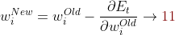
	
Equation 11  is for weight updates in susequent pass. With the aim to reduce the error E1 and E2 contributng to the complete loss for the system,a way is to adjust the contributing weights in the previous pass.
 Mathematically ,this can be achieved by adjusting the weight w.r.t to the total error i.e by taking partial derivative  of the error w.r.t weight contributing.

##### Use of Chain rule

In this case we will start the partial derivation of Error from right side to left most side of the network.
  
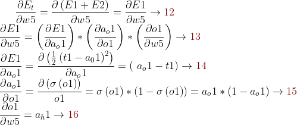 

| Equation      | calculations  |
| ------------- | ------------- |
| 12        | to calculate the partial derivative of E_total   |
| 13  | equation simplified using chain rule|
| 14, 15, 16         | partial derivative for parts from the equation 13  is clculated|

In equation 12 we find the partial derivative of E_total w.r.t weight 5.Looking at the network diagram , we see 

- 'E_total' is dependent on 'a_o1' and 
- 'a_o1' is dependent on 'o1'.
- 'o1' is dependent on 'w5'.

##Similarly getting the  partial derivative of E_total w.r.t  Weight  W6 ,  W7 and  W8

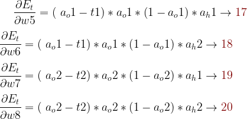 
        
##### Now  finding the partial derivative of E_total w.r.t 'w1'.There are two routes in the network

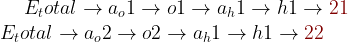  

Partial derivatives of the two routes are given below

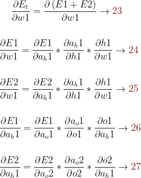

Using equation 26 in equation 24 we get the partial derivative w.r.t route of 21 , and using equation 27 in equation 25 partial derivate is calculated for  22.
To get the resultant partial derivative of E_total w.r.t 'w1' the equation  24 and 25 are added.

Solving the above parts  following equations are arraived

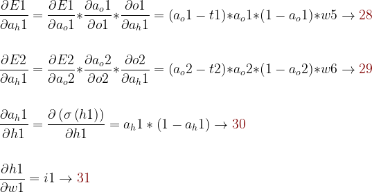

Putting the equations 28 , 29 , 30 , 31 together we get the solution for eqution 23

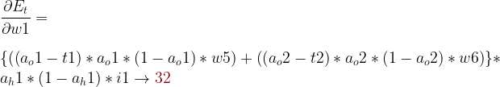

Similarly the partial derivative of *E_total* w.r.t weights w2, w3, w4 are calculated

| partial derivative    | calculations  |
| ------------- | ------------- |
| of E_total w.r.t weight w2  | ∂E_t/∂w2 = =((a_o1-t1)* (a_o1*(1-a_o1))*w5 +(a_o2-t2)* (a_o2*(1-a_o2))*w7)* a_h1*(1-a_h1) *i2  |
| of E_total w.r.t weight w3 | ∂E_t/ ∂w 3 = ((a_o1-t1)* (a_o1*(1-a_o1))*w6+(a_o2-t2)* (a_o2*(1-a_o2))*w8)* a_h2*(1-a_h2) *i1 |
|  of E_total w.r.t weight w4        | ∂E_t/∂w4 = =((a_o1-t1)* (a_o1*(1-a_o1))*w6 +(a_o2-t2)* (a_o2*(1-a_o2))*w8)* a_h2*(1-a_h2) *i2 |
 
##### After the gradient of E_total is found with respect to each weight, the  equation 11 is used to update each weight for the next propagation.

### Visualizing the results of the experiment using  numerical calculations in each step leveraging the formula features in  Excel 

Weights were initialized heuristically, in random values  and  the fomulas are updated in the excel sheet. 

### Observations of changing learning rate in the experiment

| Learning rate     | Total Error(286 th epock )   | observation |
| ------------- | ------------- |-------|
| 0.1       | 0.62  | converses slowly |
| 0.2  | .028  | converses faster than learning rate is 0.1 | 
| 0.5      | .009   | converses faster than learning rate is 0.2| 
| 0.8 | .005|  converses faster than learning rate is 0.5| 
| 1.0   | .004 |  converses faster than learning rate is 0.8 |
| 2.0       | .002  | converses faster than learning rate is 1.0 |

### In case of this experiment as the learning rate increases the Total Error or loss is less  faster i.e  the model converses to minimal loss faster when learning rate is increasing , ie  the model learns  faster.

#### When learning rate is 0.1

#### When learning rate is 0.2

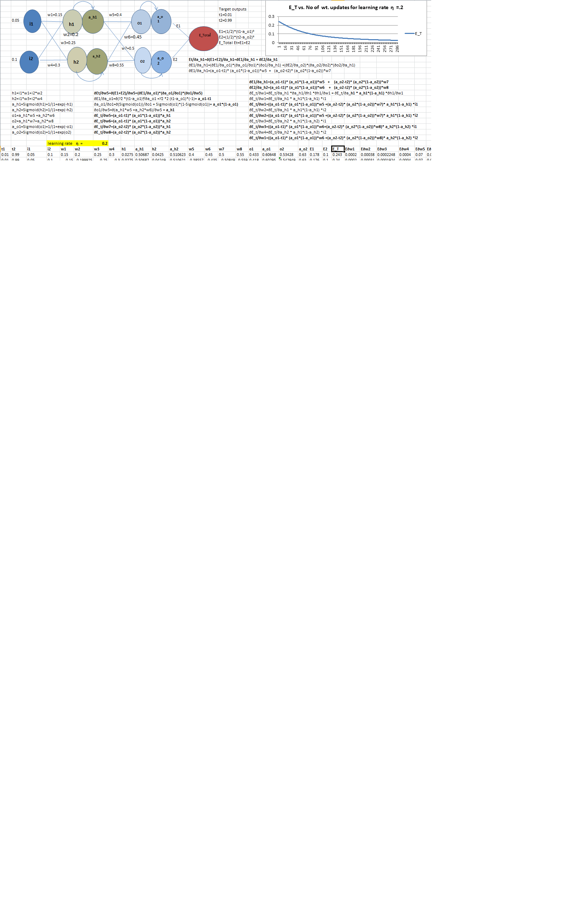

#### When learning rate is 0.5

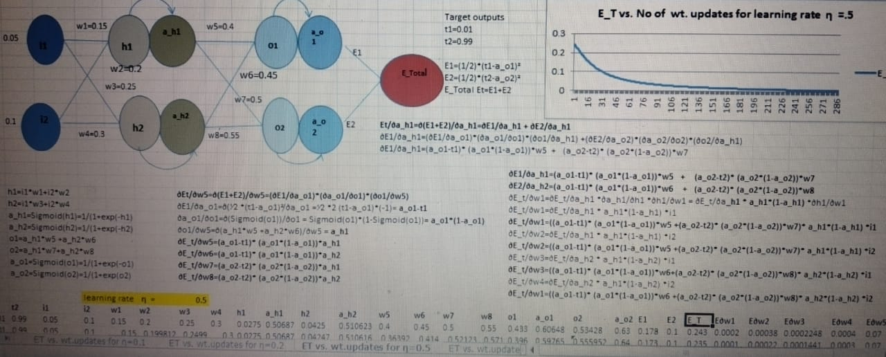

#### When learning rate is 0.8

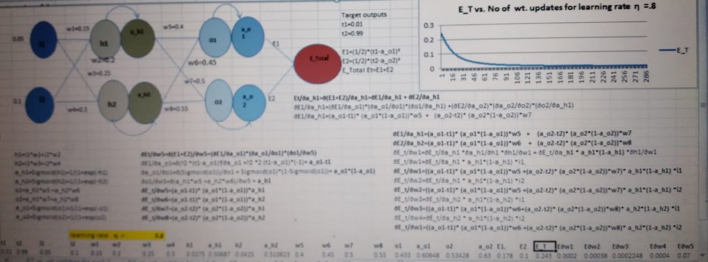

#### When learning rate is 1

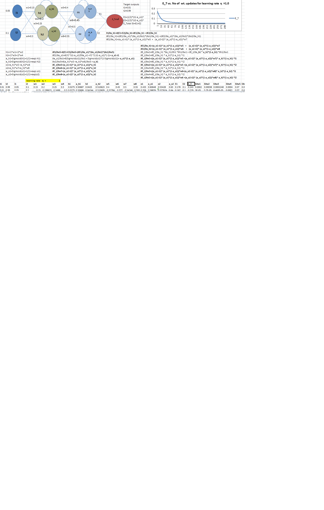

	

#### When learning rate is 2
 

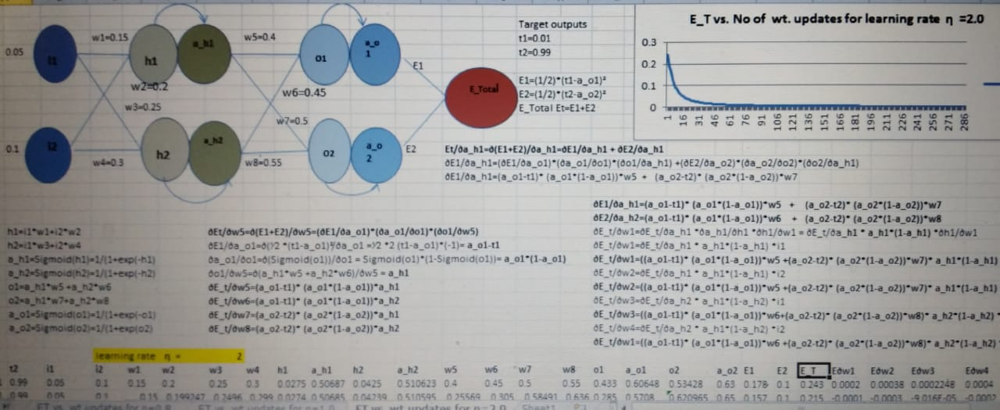

