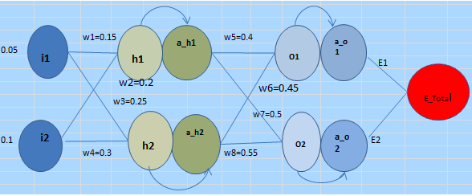

### How Neural network is getting traineed using Backpropagation algorithm

-An example 3 layer neural network  is studied in the experiment.
-The neural network is consisting 3 layers : 1 input layer , 1  hidden layer and 1 output layer and one final output.
-Each layer is with 2 neurons, neurons from each layer is connected to each neuron from the adjacent layer.
-2 weighted inputs  i1 & i2 are feed to the each of the neurons in the input layer.
-Each neuron uses sigmoid activation functions. 
###
 

###Activation 

### Mathematical basis 

##Forward Pass

##Backward Pass

### Visualizing the computations and weight adjustments in an Excel sheet

Weights were initialized heuristically, in random values. 

#### use of learning rate 

### observations of changing learning rate in the experiment

