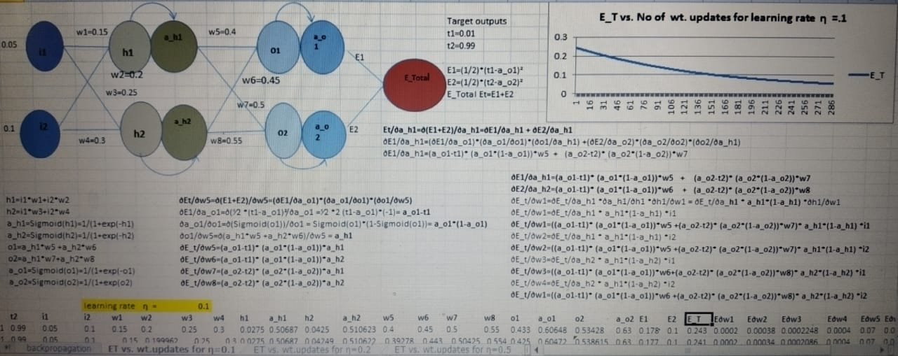
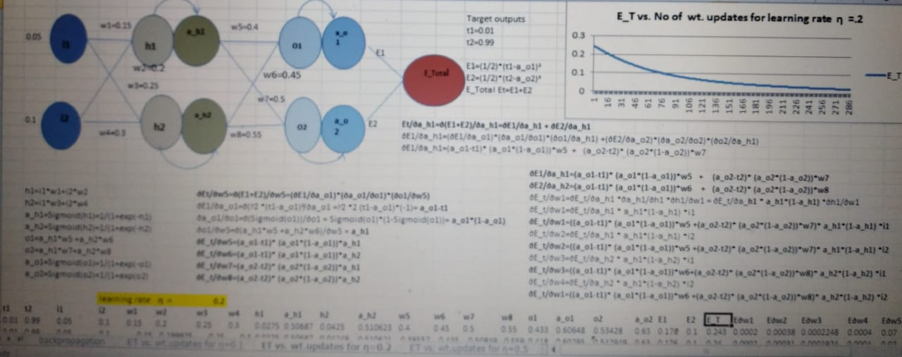

### How Neural network is getting traineed using Backpropagation algorithm

1. An example 3 layer neural network  is studied in the experiment as shown in the image below
2. The neural network is consisting of 4 fully connected neurons in the input and the hidden layer. 
3. Each of input layer and the hidden layer is with 2 neurons, and a final one output.
4. 2 weighted inputs  i1 & i2 are feed to the each of the neurons in the input layer.
5. Each neuron uses Sigmoid activation functions. 

     

   #### Activation using Sigmoid 
   The general definition of is Sigmoid(x)= 1/(1+exp(-ax)) where a is the slope
   Graph of sigmoid function is S(slanted right) shaped. This is the most common activation function used .
   It is strictly increasing function, exhibiting a balance between linear and nonlinear behaviour. 
   The activation function helps to handle the nonlinearity of the data

### Mathematical basis 

The neural network is considered as a system where neurons are fully connected with weighted edges,the aim is to find the optimum values of weights in the edges , such that the deviation from the real ouput is minimum. Training the neural network is that the network is establised with the optimum numeric weights,such that it works as optimum approximator or predictor for the desired functionality. The deviation at the final output layer is termed as loss , which is the total loss 
in the two last edges in the diagram  E1 and E2 , E_Total = E1 + E2

#### Forward propagation

The inputs I1 and I2 are fed to the input layer. 
The mathematical equations are shown below. 

 

| Equation      | calculations  |
| ------------- | ------------- |
| 1 & 2         | the weighted inputs to the two neurons in th einput layer  |
| 3 & 4   | the output of sigmoid activation from thetwo input neurons |
| 5 & 6        |  calculates the weigted inputs to the 2nd layer neurons |
| 3 & 4   | the output of sigmoid activation out of 2nd layer neurons |
| 9 & 10   | the mean square error of the 2nd layer neurons output activation from the final expected target value |

#### Backward propagation

Equation 11  is for weight updates in susequent pass. With the aim to reduce the error E1 and E2 contributng to the complete loss for the system,a way is to adjust the contributing weights in the previous pass.
 Mathematically ,this can be achieved by adjusting the weight w.r.t to the total error i.e by taking partial derivative  of the error w.r.t weight contributing.

##### Use of Chain rule

In this case we will start the partial derivation of Error from right side to left most side of the network.
  
 

In equation 12 we find the partial derivative of E_total w.r.t weight 5.Looking at the network diagram , we see 

- 'E_total' is dependent on 'a_o1' and 
- 'a_o1' is dependent on 'o1'.
- 'o1' is dependent on 'w5'.

So based on chain rule we get equation 13.We can breakup equation 13 into three parts and find the partial derivative for each part as given by equation 14 , 15 , 16.

Similarly we can find the partial derivative of E_total w.r.t 

- weight 6
- weight 7
- weight 8

The result is shown below

 
        
##### Now we need to pause and think , how to find the partial derivative of E_total w.r.t 'w1'.There are two routes in the network

  

Partial derivatives of the two routes are given below

When we embed equation 26 in equation 24 we get the partial derivative w.r.t route 21 , similarly when we embed equation 27 in equation 25 we get route 22.To get the resultant partial derivative of E_total w.r.t 'w1' we have to add the reult of equation 24 and 25.

Solving the above parts we get the following equations

Putting the equations 28 , 29 , 30 , 31 together we get the solution for eqution 23

Similarly we can find the partial derivative of *E_total* w.r.t

- weight 2
- weight 3
- weight 4
 
##### After the gradient of E_total is found with respect to each weight, we can use equation 11 to update each weight.

### A working example

The network shown in the beginning is used to test the above solution and generate a plot of L2 loss across different epoch for different learning rate.A range of learning rate was used to check the behavior of the model , the result is summarized below.

### Visualizing the computations and weight adjustments in an Excel sheet

Weights were initialized heuristically, in random values. 

#### use of learning rate 

### observations of changing learning rate in the experiment

| Learning rate     | Total Error(286 th epock )   | observation |
| ------------- | ------------- |-------|
| 0.1       | 0.62  | converses slowly |
| 0.2  | .028  | converses faster than learning rate is 0.1 | 
| 0.5      | .009   | converses faster than learning rate is 0.2| 
| 0.8 | .005|  converses faster than learning rate is 0.5| 
| 1.0   | .004 |  converses faster than learning rate is 0.8 |
| 2.0       | .002  | converses faster than learning rate is 1.0 |

#### When learning rate is 0.1

#### When learning rate is 0.2

#### When learning rate is 0.5

#### When learning rate is 0.8

#### When learning rate is 1

	

#### When learning rate is 2
 

	The model is converging faster and error is close to 0 after 76 epoch.

