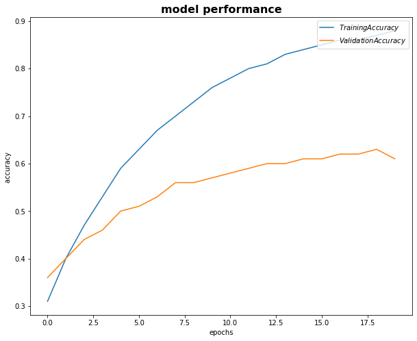
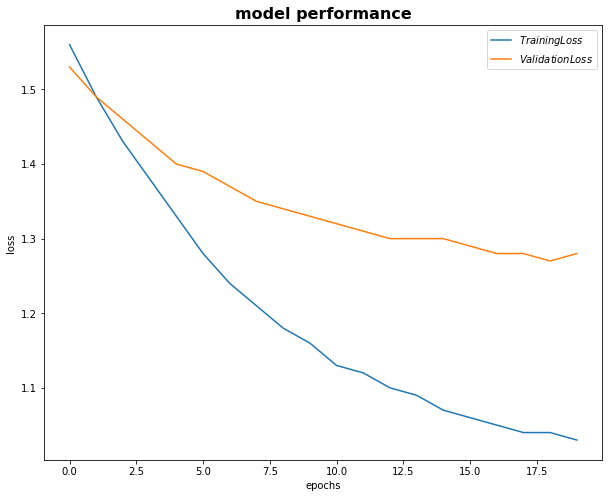

### Session 5

Authors- Deepak Hazarika ,Parinita Bora ,Mohan Sai Srinivas Y    
3 June 2021 

#### Assignmengt Abstract

The StanfordSentimentAnalysis dataset is augmented by doing random swap, random deletion of words, translate the sentence to a random language and re-translate to english and substitute synonym in the sentence n number of times.
This dataset is fed to a LSTM model with 2 layer to predict the label. The validation accuracy is around 62% after 20 epochs.The model was fine tuned by choosing different dropout rates, however it did not have much effect on the performance.
A future project will be to tune the model using other hyper-parameters  like number of layers in the LSTM etc.

#### Data augmentation strategy

#### About the Dataset :

- The dataset StanfordSentimentAnalysis is of movie reviews along with the labels
- There are 11286 reviews with labels
- There are 5 categories of label

| range of float value | integer label | Category |
| --- | --- | --- |
| 0 <= value <= 0.2 | **0** | Very Negative |
| 0.2 < value <= 0.4 | **1** | Negative |
| 0.4 < value <= 0.6 | **2** | Neutral |
| 0.6 < value <= 0.8 | **3** | Positive |
| 0.8 < value <= 1.0 | **4** | Very Positive |

#### A Class was created to handle data augmentation 

#### Following API's are supported

|sl. |  method | details |  
| --- | --- | --- |  
| 1. | **getLabelIndex(self , value)** | Input : a float value ; Output : an integer label | 
| 2.  | **getSentences(self)** | This method will load the datasetSentences file and extract   string id's ,  review comments ; store this in a dataframe| 
| 3. | **getPhraseIds(self):** | This method will load the dictionary file and extract phrases , phrase ids ;    store this in a dictionary |
| 4.| **getSentimentLabels(self)** | This method will load the sentiment_labels file and extract  phrases ids ,labels which are float value between 0 and 1 , including 0 and 1 ; store this in a dictionary |
| 5. |  **getSentenceLabelsDF(self):** | This method finds label for the review comment --  go through the list of review comments +  check if the sentence exists as a phrase in the dictionary ; if yes then get the phrase id and find the label for the given phrase id in labels dictionary ; store the review comment and the label in a data frame object |
| 6. |  **getSentenceandLabels(self)** | his is a wrapper function  calls  , getSentimentLabels() , getPhraseIds()     +  getSentences()  , getSentenceLabelsDF() ; The result is stored in a sentence label data frame |
| 7. | **getSpacyTokens(self , sentence):** | This is a helper method to get spacy tokens of a sentence, a rule has been included to ignore apostrophe as a separate token., Input : Sentence ;   Output - tokens
| 8. |  **random_deletion(self , sentence, p=0.3)** | This method randomly deletes words from a sentence based on a probability.If the probability is less then a threshold , then drop the word. ,  Input : Sentence , Output - modified sentence |
| 9.| **random_swap(self , sentence, n=3):** | This method randomly swaps n number of words in a sentence. , Input : Sentence  ,  Output - modified sentence |
| 10.| **getReTranslatedSentence(self , sentence):** | This method uses google translation package to translate the sentence to a random destination language, which is then retranslated to english.  Input : Sentence  , Output - modified sentence |
| 11. | **removeStopWord(self, sentence):** | This method uses spacy token attributes to check if it is a stop word ;   If yes then drop the word    Input : Sentence ;  Output - modified sentence |
| 12.| **insertSynonymNTimes(self , input , numTimes):** | This method is used to insert synonym for a word n number of times , this is a way to emphasise some words in the sentence.Wordnet library is used to get synonym for a word.The list of synonym is narrowed down based on domain.SInce these sentences are about movie , so the domain is set to celluloid etc.More about domain information can be found at domains - https://wndomains.fbk.eu/hierarchy.html  ;    Input : Sentence ; Output - modified sentence |
| 13. |  **random_insertion(self , sentence, howmanytimes = 3):** | This is a wrapper method which call the removestop word and insertSynonymNTimes.   +  Input : Sentence ; Output - modified sentence |

#### Augmentation 

The original dataset has 11286 review comments , four data augmentation methods 

+  random swap
+  random deletion
+  random insertion
+  retranslate to english using google translate

These augmentation is applied to increase the dataset size to 56430 records.The augmented dataset is then saved and  used for training the model and in validation.

#### Model design
 
The model has

| Layer | Input nodes | Output nodes |
| --- | --- | --- |
| Embedding | 30304 | 300 |
| 2 layers of LSTM  | 300 | 100 |
| Linear | 100 | 5 |

**9,333,305** trainable parameters

#### Data split

The data was split into training and validation in the ratio of 85:15 using BucketIterator.

#### Model performance

The model was run for 20 epochs , in the last epoch

+ Train Loss: 1.030 | Train Acc: 87.86%
	
+ Val. Loss: 1.284 |  Val. Acc: 61.50% 
  
A graph showing the plot of loss and accuracy across 20 epochs is shown below.

  

#### Model test output for ten record

True label: negative

Predicted label: very negative

Input Sentence: **The movie of n't think much us its characters , its . , or of does protagonist**

---------------------------------

True label: negative

Predicted label: neutral

Input Sentence: **bake cardboard ask ask ask call_for call_for call_for chew .**

---------------------------------

True label: neutral

Predicted label: neutral

Input Sentence: **It 's all pretty tame .**

---------------------------------

True label: very positive

Predicted label: negative

Input Sentence: **The to take the level performances a higher . movie**

---------------------------------

True label: positive

Predicted label: negative

Input Sentence: **The powerful success of Read My Lips with such provocative why - material , after only three films , director/co in writer Jacques Audiard , though little known in this country , belongs shows the very top rank of French filmmakers .**

---------------------------------

True label: very positive

Predicted label: positive

Input Sentence: **Children will like its fantasy and adventures , and adults should appreciate their humor .**

---------------------------------

True label: positive

Predicted label: negative

Input Sentence: **If like , guts and crazy beasts stalking with though you will enjoy this monster .**

---------------------------------

True label: negative

Predicted label: very negative

Input Sentence: **Entertains not so much because of its music or comic antics , but through the perverse pleasure of watching Disney scrape the bottom of its own cracker barrel .**

---------------------------------

True label: negative

Predicted label: very negative

Input Sentence: **I 'd be hard pressed to think of a film more cloyingly sappy than Evelyn this year .**

---------------------------------

True label: very positive

Predicted label: very positive

Input Sentence: **The case is a convincing and give anyone with conscience reason to pause .**

---------------------------------

### Further analysis of model performance for different dropout value - 0.2 , 0.4 , 0.6

A plot of loss and accuracy is shown below for reference

As evident from the graph , training accuracy hovered above 85% and validation accuracy hovered around 61% after 20 epochs for different dropout value.

### Future work

Try tuning other parameters like 

+ Number of LSTM layers

+ bidirectional = True

to check model performance
### Training logs 

* A dump of log is given below for reference

Train Loss: 1.563 | Train Acc: 30.83%
	 Val. Loss: 1.527 |  Val. Acc: 36.45% 

	Train Loss: 1.490 | Train Acc: 40.45%
	 Val. Loss: 1.488 |  Val. Acc: 40.28% 

	Train Loss: 1.432 | Train Acc: 46.69%
	 Val. Loss: 1.459 |  Val. Acc: 43.50% 

	Train Loss: 1.377 | Train Acc: 52.76%
	 Val. Loss: 1.431 |  Val. Acc: 46.30% 

	Train Loss: 1.325 | Train Acc: 58.56%
	 Val. Loss: 1.401 |  Val. Acc: 49.86% 

	Train Loss: 1.282 | Train Acc: 63.03%
	 Val. Loss: 1.386 |  Val. Acc: 51.20% 

	Train Loss: 1.245 | Train Acc: 66.94%
	 Val. Loss: 1.368 |  Val. Acc: 53.02% 

	Train Loss: 1.211 | Train Acc: 70.40%
	 Val. Loss: 1.349 |  Val. Acc: 55.54% 

	Train Loss: 1.181 | Train Acc: 73.39%
	 Val. Loss: 1.339 |  Val. Acc: 56.08% 

	Train Loss: 1.156 | Train Acc: 75.90%
	 Val. Loss: 1.328 |  Val. Acc: 57.44% 

	Train Loss: 1.135 | Train Acc: 77.94%
	 Val. Loss: 1.322 |  Val. Acc: 57.81% 

	Train Loss: 1.116 | Train Acc: 79.68%
	 Val. Loss: 1.314 |  Val. Acc: 58.77% 

	Train Loss: 1.101 | Train Acc: 81.17%
	 Val. Loss: 1.302 |  Val. Acc: 59.86% 

	Train Loss: 1.086 | Train Acc: 82.63%
	 Val. Loss: 1.300 |  Val. Acc: 60.06% 

	Train Loss: 1.074 | Train Acc: 83.63%
	 Val. Loss: 1.298 |  Val. Acc: 60.51% 

	Train Loss: 1.062 | Train Acc: 84.86%
	 Val. Loss: 1.289 |  Val. Acc: 61.37% 

	Train Loss: 1.052 | Train Acc: 85.84%
	 Val. Loss: 1.282 |  Val. Acc: 61.92% 

	Train Loss: 1.045 | Train Acc: 86.45%
	 Val. Loss: 1.280 |  Val. Acc: 61.96% 

	Train Loss: 1.038 | Train Acc: 87.11%
	 Val. Loss: 1.274 |  Val. Acc: 62.75% 

	Train Loss: 1.030 | Train Acc: 87.86%
	 Val. Loss: 1.284 |  Val. Acc: 61.50%

